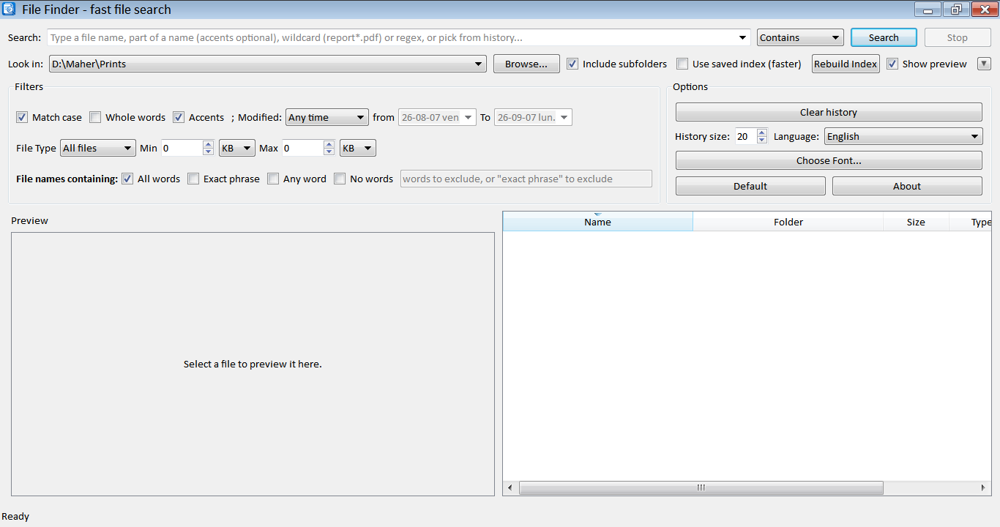

# File Finder

A fast, lightweight desktop file-search tool built with **PyQt5**, designed
to run smoothly on **Windows 7 (32-bit)**.

It works like a mini "Everything"/Windows-Search replacement: type a name
(or part of one), pick where to look, and results stream in live while the
scan runs in a background thread so the UI never freezes. For drives you
search often you can build a small on-disk index so repeat searches come
back almost instantly.



## Features

- **Live, non-blocking search** - results appear in the table as they're
  found; the UI stays responsive and you can cancel at any time.
- **Three match modes** - plain "contains" text, wildcard (`report*.pdf`,
  `img_????.jpg`), or full regular expressions, with an optional
  case-sensitive toggle.
- **Location picker** - search a whole drive, your home folder, or any
  folder you browse to; optionally restrict to the top level only (no
  subfolders).
- **Filters** - by file type (Documents / Images / Music / Video /
  Archives / Executables / custom extensions), by size range, and by last
  modified date (today, past 7/30 days, this year, or a custom range).
- **Optional saved index** - "Rebuild Index" walks a location once and
  stores every file path in a small SQLite database next to your user
  profile; ticking "Use saved index" then answers searches straight from
  that database instead of touching the disk again.
- **Result actions** - double-click (or right-click menu) to open a file,
  reveal it in Explorer, copy its full path/name, or send it to the
  Recycle Bin.
- **Search history** - your last searches are remembered and offered as
  autocomplete suggestions.
- **Sortable results table** with per-file icons, folder, size, type and
  last-modified date.
- **Accent-insensitive, wildcard-friendly search** - "Ciric" also finds
  "Ćirić" (toggle with the "Ignore accents" checkbox), and "*" is always
  an open-ended wildcard, e.g. "*iric" or "Ciric*contraction" find
  "Ćirić_notes.docx" or "Notes on Ciric's contraction (final).pdf".
- **Collapsible Filters panel** - click the "▼ Filters" / "▶ Filters"
  triangle at the end of the "Look in" row to show or hide the Filters
  box, freeing up vertical space for the preview/results area.
- **Search history dropdown** - the Search box is a combo box: click the
  arrow to pick a previous search, or just type as normal.
- **Options panel** (next to Filters): **Clear history** resets the
  search and "Look in" dropdowns to their defaults, a spin box sets how
  many entries those histories keep, **Choose Font...** changes the
  font used throughout File Finder (remembered for next time),
  **Default** restores all search/filter/appearance settings to their
  defaults (history is left alone - that's what Clear history is for),
  and **About** shows version and app info.
- **PDF/DJVU preview pane** - tick "Show preview" to open a resizable
  panel (50/50 split by default) with a single icon-only toolbar at the
  top (all buttons the same size, like a real toolbar):
  - real scrollbars, so pages taller than the pane scroll normally;
  - Prev/Next (triangle icons) and a page number box;
  - zoom with the +/- buttons, Ctrl +/- , Ctrl+0, or Ctrl+scroll wheel;
  - **Fit page width** / **Fit page to window** buttons for one-click
    zoom presets (fit width = same as Ctrl+0; fit window shrinks or
    grows so the whole page fits without scrolling);
  - plain scroll wheel scrolls inside the current page, and rolling
    past the top/bottom edge turns to the previous/next page;
  - **Show pages continuously** / **Show a single page** buttons to
    switch between one-page-at-a-time and a continuous scroll through
    every page (pages render lazily as they scroll into view).
- **.docx preview** - Word documents render with headings, bold/italic/
  underline, and tables, using [python-docx](https://python-docx.readthedocs.io/)
  (`pip install python-docx`). Legacy `.doc` files aren't supported by
  that library and show an explanatory message instead.
- **Plain-text preview for everything else** - any other file (source
  code, logs, config files, etc.) up to 5 MB shows as text; files that
  don't look like text (detected via a NUL-byte check) or that are
  larger than that show a message instead of unreadable content.
- **Native Explorer context menu** - right-click a result and choose
  "Show Windows context menu..." to get the real Explorer menu for that
  file (including entries from other installed apps), not just File
  Finder's own actions. Icons are carried over from the shell menu
  where Windows exposes them as a plain bitmap; some shell extensions
  draw their icon a different way Explorer only supports while its own
  menu is on screen, so a few entries may show without one.
- **Copy List** - select several rows and right-click to copy all of
  their full paths to the clipboard at once.
- **Runs from the system tray** - closing the window minimizes File
  Finder to the notification area instead of quitting; use the tray
  icon to reopen it or exit for good.

## Requirements

Tested combination that still ships official 32-bit ("win32") wheels and
installs cleanly on Windows 7 SP1:

| Component | Version                                  |
|-----------|-------------------------------------------|
| Python    | 3.8.10 (32-bit) - last Python.org installer that supports Windows 7 |
| PyQt5     | 5.15.11 - last PyQt5 release with a `win32` wheel on PyPI |
| send2trash| 1.8.3 (optional - enables Recycle Bin delete instead of permanent delete) |
| pywin32   | 306 (optional - enables the native "Show Windows context menu..." item) |
| PyMuPDF   | 1.18.19 (optional - enables PDF pages in the preview pane; this is the last version with a 32-bit Windows wheel) |
| python-docx | 0.8.11+ (optional - enables the .docx preview; everything else falls back to plain text or a message) |

These are pinned in `requirements.txt`. Everything marked "optional" degrades
gracefully if it's missing - File Finder still runs, just without that one
feature (e.g. no "Show Windows context menu..." entry, or a message in the
preview pane telling you what to install).

### DJVU preview - a separate, non-pip dependency

The preview pane renders DJVU pages by calling the djvulibre command line
tools (**not** a Python package), the same tools/approach used in the
DjVu viewer this feature was adapted from:

- `ddjvu.exe` - renders a page to an image
- `djvused.exe` - reports the page count

**If you build with `Filefinder.bat`**, these (plus the DLLs they need)
are bundled straight into the build via `--add-binary`, and File Finder
finds them automatically at startup - nothing to configure. This is
the normal path; `Filefinder.iss`'s installer expects a build made this
way.

**Running from source instead** (`python main.py`), or using
`build_exe.bat`'s plain `--onefile` build instead of `Filefinder.bat`:
put `ddjvu.exe`, `djvused.exe` and the DLLs they need
(`libdjvulibre*.dll`, `libgcc_s_seh-1.dll`, `libstdc++-6.dll`,
`libwinpthread-1.dll`, `libjpeg.dll`, `libtiff.dll`, `libz.dll`) in
`resources/djvulibre/` next to `main.py` - `_default_djvu_tools_dir()`
in `app/preview_pane.py` checks there too. If they're already on your
system `PATH`, no configuration is needed at all either way.

## Setup on Windows 7 (32-bit)

1. Install **Python 3.8.10 (32-bit)** from python.org (search "Python
   3.8.10 Windows x86 executable installer"). During install, tick
   "Add Python to PATH".
2. Copy this `filefinder` folder onto the machine.
3. Double-click **`run.bat`**. The first run will:
   - create a local virtual environment (`venv`)
   - install PyQt5 and send2trash from `requirements.txt`
   - launch the app

   Subsequent double-clicks just reuse the existing environment and start
   the app immediately.

   If you'd rather do it by hand from a command prompt:

   ```bat
   cd filefinder
   python -m venv venv
   venv\Scripts\activate
   pip install -r requirements.txt
   python main.py
   ```

## Building a standalone .exe (optional)

If you want a single `FileFinder.exe` that doesn't require Python to be
installed on the target machine, run `build_exe.bat` **on the Windows 7
32-bit machine itself** (PyInstaller builds are not cross-platform/
cross-arch, so build on the same bitness/OS you'll run on):

```bat
build_exe.bat
```

This creates `dist\FileFinder.exe`. The script pins PyInstaller to 4.10,
the last release line with solid Windows 7 support.

## Explorer context menu ("Open with File Finder")

Adding a "File Finder" entry to Explorer's right-click menu - that opens
the app with the clicked folder already selected in "Look in" - needs
**two separate things**, one on each side:

1. **App side (already done in this codebase):** `main.py` accepts a
   folder path as a plain command-line argument
   (`FileFinder.exe "C:\path\to\folder"`) and pre-selects it in "Look
   in" as soon as the window opens (see `_folder_from_args()` in
   `main.py` and `_set_location()` in `app/main_window.py`).
2. **Installer/registry side (not a PyQt5 concern):** Windows builds
   its right-click menus from the registry, not from anything the app
   itself can register at runtime. You need a
   `HKEY_CLASSES_ROOT\Directory\shell\FileFinder\command` key whose
   default value is `"C:\path\to\FileFinder.exe" "%1"` - `%1` is what
   Explorer replaces with the clicked folder's path, which is exactly
   what `_folder_from_args()` is waiting to receive.

Two ready-to-use files are in `installer/`:

- **`FileFinder_context_menu.reg`** - edit the `.exe` path inside it,
  double-click to merge it, and test the menu entry immediately without
  touching your installer at all.
- **`context_menu_example.iss`** - the same registry keys as an Inno
  Setup `[Registry]` section (using `{app}`, so no hardcoded path, and
  `uninsdeletekey` so it's cleaned up on uninstall) - paste it into your
  `.iss` script once you're happy with how it behaves.

Both register two entries: right-clicking a folder itself, and
right-clicking empty space *inside* a folder (via `%V` instead of
`%1`) to search that open folder without picking a specific subfolder.
Delete the "Background" half of either file if you only want the first
one. Since both write to `HKEY_CLASSES_ROOT`, the installer needs to
run elevated (Inno Setup's default).

`Filefinder.bat` and `Filefinder.iss` at the project root are a real,
working build/installer pair (not just examples) - `Filefinder.iss`
already includes the context menu keys above plus a "Run Filefinder
automatically when Windows starts" install-time checkbox, which adds a
`/tray` autostart entry (main.py's `_wants_tray_start()` reads that
flag and keeps the app in the system tray only, without opening the
main window).

File Finder is single-instance: every launch - a Windows-startup
`/tray` launch, a manual double-click, or repeated "Open with File
Finder" context menu clicks - detects whether it's already running
(see `app/single_instance.py`) and, if so, just forwards its folder
(or brings the window to the front) to that instance instead of
starting a new process. Without this, each context menu click would've
spawned an entirely new process with its own tray icon, piling up next
to the previous ones.

## Using the app

1. Type your search text into the **Search** box.
2. Pick **Contains**, **Wildcard** or **Regex** matching, and toggle
   **Case sensitive** if needed.
3. Choose where to look in **Look in** (a drive, your home folder, or
   **Browse...** to any folder), and whether to include subfolders.
4. Optionally expand **Filters** to restrict by file type, size or date
   modified.
5. Click **Search** (or press Enter). Results stream into the table;
   click **Stop** (or press Esc) to cancel a long search.
6. Double-click a result to open it, or right-click for more actions:
   - single selection: Open, Open containing folder, Copy full path/name,
     Delete (Recycle Bin), Show Windows context menu...
   - multiple selection: Copy full path/name (of the row you right-clicked),
     **Copy List** (paths of every selected row), Delete, Show Windows
     context menu... (applies to all selected files at once)
7. Tick **Show preview** above the table to open the PDF/DJVU preview
   pane; select a `.pdf`/`.djvu`/`.djv` result to see its first page, and
   use the Prev/Next buttons (or the page number box) to flip pages.

### Speeding up repeat searches with the index

For a drive you search a lot (e.g. `C:\`), click **Rebuild Index** once.
It walks the whole location and stores every file's path, size and
modified date in a local SQLite database
(`%APPDATA%\FileFinder\file_index.db`). Afterwards, tick **Use saved
index (faster)** and searches against that location are answered
straight from the database - no disk walk needed - until you rebuild it
again to pick up new/changed files.

## Project layout

```
filefinder/
├── main.py                    # entry point
├── app/
│   ├── main_window.py         # PyQt5 UI, wiring, actions, tray icon
│   ├── search_worker.py       # QThread workers: live search & index build
│   ├── index_manager.py       # SQLite-backed file index
│   ├── preview_pane.py        # PDF/DJVU/.docx/text preview panel + workers
│   ├── native_context_menu.py # real Explorer right-click menu (Windows/pywin32)
│   └── utils.py                # helpers (sizes, drives, open/reveal/etc.)
├── resources/
│   ├── icon.png / icon.ico
│   └── djvulibre/              # (you add this) ddjvu.exe, djvused.exe, DLLs
├── requirements.txt
├── run.bat                     # one-click setup + launch on Windows
└── build_exe.bat               # optional PyInstaller packaging
```

## Notes

- On non-Windows systems (used here only for development/testing) the
  "open file", "reveal in folder" and "drive list" helpers automatically
  fall back to `xdg-open`/`open` and the filesystem root, so the app still
  runs, just without Windows-specific integration.
- Deleting a file uses the Recycle Bin via `send2trash` when that package
  is installed; otherwise it asks for confirmation and deletes
  permanently.
- Closing the window (the "X" button) hides File Finder to the tray
  instead of quitting; use **Exit** from the tray icon's right-click menu
  to actually close the app. On systems without a system tray (or on
  Linux/macOS dev machines without one available), closing the window
  quits normally.
